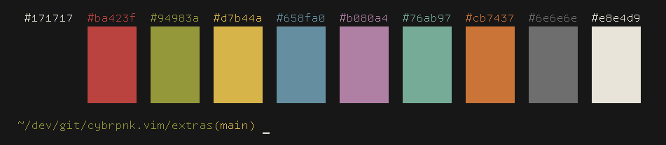

# cybrpnk
an aesthetically pleasing colorscheme that's easy on the eyes

## features
- [X] extensible through lush
- [X] treesitter (defaults)
- [X] custom lualine theme
- [X] performant (<5ms startup time)
- [ ] custom treesitter definitions
- [ ] lsp definitions
- [ ] vim & lush-less support

## acknowledgements
- [lush](https://github.com/rktjmp/lush.nvim) used to programatically create colorscheme
- [lualine](https://github.com/nvim-lualine/lualine.nvim) for great theming docs
- [gruvbox](https://github.com/morhetz/gruvbox) for the retro inspiration
- [tomorrow](https://github.com/ChrisKempson/Tomorrow-Theme) for showing me a good colorscheme doesn't have to strain your eyes
